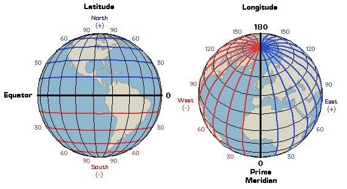
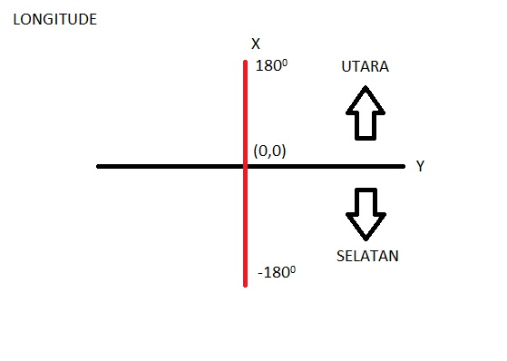
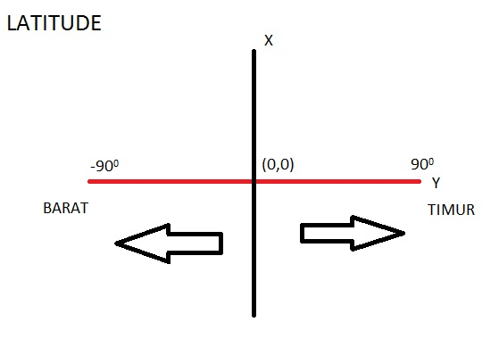

Resume Matakuliah “Sistem Informasi Geografis”

  

**Sistem Informasi Geografis (SIG)**

**Sistem** adalah sekelompok komponen yang digabungkan menjadi satu untuk mencapai tujuan.

**Informasi** adalah sekumpulan data atau makna yang tertentu sehingga mempunyai arti bagi penerima, atau juga penerangan, keterangan, pemberitahuan, kabar atau berita.

**Geografis** adalah ilmu yang mempelajari tentang lokasi serta persamaan dan perbedaan dari permukaan bumi. Letak suatu wilayah atau Negara sesuai dengan kenyataannya di permukaan bumi dan didasarkan pada keadaan alam disekitarnya.

**Sistem Informasi Geografis** adalah sistem informasi yang berdasar pada data keruangan dan mempresentasikan obyek di bumi. Dalam SIG teknologi informasi merupakan data, memproses data, menaganalisa data, mengelola data dan menyajikan informasi seputar geografis. Di dalam geografis itu sendiri terdapat geo spasial, geo artinya bumi dan spasial adalah ruang yang berarti bahwa geospasial adalah letak permukaan bumi yang dinyatakan dalam sebuat kordinat , kordinat itu sendiri mempunyai satuan derajat.

**Longitude dan Latitude**

**Longitude** adalah garis bujur garis horizontal. Angka dari sudut bundar bumi horizontal. Titik diawali dari 0 ke 1800 dan 0 ke -180 ke arah sebaliknya. Yang membagi daerah menjadi bagian utara dan selatan.

**Latitude** adalah garis garis lintang mengarah katulistiwa (0). Titik yang dipakai dari 0 ke 900 dan 0 ke -900 ke arah sebaliknya . Yang membagi daerah menjadi bagian barat dan timur.

Dan terdapat titik dengan koordinat (0,0) terletak di sebuah Negara Inggris di Greenwich. Greenwich dipercaya dan disepakati oleh banyak ilmuwan sebagai pusat nol derajat sebagai awal perhitungan waktu atau disebut Greenwich Mean Time (GMT) pada 1884. Mengapa bisa sampai dijadikan sebegai sebagai pusat dari titik koor (0,0) itu dikarenakan oleh daya magnet yang kecil pada porosnya

Dibawah ini adalah gambaran dari Longitude dan Latitude

-   Longitude

  

-   Latitude

  

Kesimpulan dan Saran:

-   Kesimpulan dari resume diatas adalah jadi kita dapat memahami tentang Sistem Informasi Geografis dengan geospasialnya membahas tentang geografis dan koordinat yang ada serta memiliki 2 SIG yatu Longitude dan Latitude

-   Saran dari saya yaitu semoga yang membaca artikel ini dapat memahami dan lebih memahami tentang system informasi geografis terutama lebih mengembangkan lagi lebih mecari tau lagi tentang Sistem Informasi Geografis
