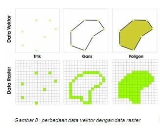

**Rangkuman Pertemuan 2 dan 3 Sistem Informasi Geografis**

  

Latar Belakang Masalah

Data geospasial yang menggunakan titik koordinat yang di antaranya mencakup proyeksi peta. Didalam peta tersebut ada geospasial. Data geospasial mempunyai bagian yang penting yang membuatnya berbeda dari yang lain, yaitu informasi lokasi dan informasi lokasi dan informasi atribut yang dapat dijelaskan.

1.	Apa itu data Geospasial?
2.	Apa itu data Vektor pada Geospasial?
3.	Apa itu data Raster pada Geospasial?
4.	Apa saja yang ada didalam data vector?
5.	Apa fungsi dari Shapefile/shp?
6.	Apa yang harus digunakan untuk melihat jumlah shapefile?
Data Geospasial adalah data yang berkaitan dengan lokasi geografis, karakteristik tentang obyek alam dan atau buatan manusia yang berada dibawah dan diatas permukaan bumi.

Didalam Geospasial dibagi menjadi 2 jenis yaitu
-	Cultural yaitu data geospasial hasil peradaban manusia, didalam cultural itu ada batas wilayah.
-	Physical yaitu fata geospasial yang terlihat secara kasat mata.

Didalam Geospasial dibagi menjadi 2 bagian yaitu vector dan raster.
Data Vector adalah data yang memiliki titik, garis dan polygon. Data vektor ini dapat digunakan untuk keperluan rancangan pembangunan pada peta.  

  

Data Raster adalah data yang disimpan dalam bentuk yang kotakk berbentuk segi empat dan nilainya menggunakan gambar berwarna, sehingga terbentuk suatu ruang yang teratur.
Data vector juga dapat dijelaskan dengan suatu data yang dapat mempresentasikan bumi sebagai mozaik garis, titik, dan polygon seperti yang tadi sudah dijelaskan diatas. Didalam data vector itu terdapat sebuah class, salah satunya yaitu shapefile atau shp.
Shapefile ini adalah format yang banyak digunakan untuk menyimpan data geografis vector. Shapefile sebenarnya kumpulan beberapa file yang berbeda. Fungsi dari Shapefile ini yaitu dapat menyimpan data geografis juga dapat menghitung jumlah kota yang ada pada ruang lingkup tertentu menggunakan beberapa sistem. 

Dalam penggunaanya untuk melihat data shapefile kita dapat menggunakan python. Pada shapefile atau shp disini juga terdapat beberapa method. Sebagai contohnya adalah method reader dan shape. Untuk method reader itu sendiri untuk membaca data yang ada pada file shp. Untuk mendapatkan hasil kita bisa menggunakan codingan seperti dalam shapefile.Reader(“shp/nunu.shp”) dari file shp data didapatkan. Sedangkan method shapes ini berguna untuk membaca shapes atau data yang ada pada file shp. Jadi dari codingan tersebut dapat mendapatkan output daftar data geografis dan jumlah dari data shp itu sendiri. Dalam melihat data itu pun kita dapat menggunakan Phyton , PySHP, dan pipi yang dapat dijalankan prosesnya di Command prompt.

Penutup

Kesimpulan

Jadi dari sini kita dapat ambil bahwa geospasial itu dibagi menjadi dua yaitu vector dan raster dan didalam vector itu kita dapat menyimpan data geografis dan dapat menjumlahkan jumlahdata yang ada pada shapefile.

Saran 

Sebaiknya lebih banyak lagi penggunan yang menggunakan dan memahami baik tentang geospasial dan shapefile dalam penggunaan data shapefile.

Link Github: https://github.com/Nurpazrina/SistemInformasiGeografis

Nurpazrina 
1144054 
D4 Teknik Informatika 3B  
Politeknik Pos Indonesia  

Referensi:

http://docplayer.info/387436-Pengelolaan-data-geospasial.html  
http://nilaamallia.blogspot.co.id/2011/01/data-vektor-dan-data-raster.html
http://learnosm.org/bi/osm-data/file-formats/

Plagiarisme:

By smallseotools :

https://drive.google.com/open?id=0B_4FZrdBxSUQb3FmYTJlaWQ2eTQ

By duplichecker :

https://drive.google.com/open?id=0B_4FZrdBxSUQamF2R1Q5bDZscFk

